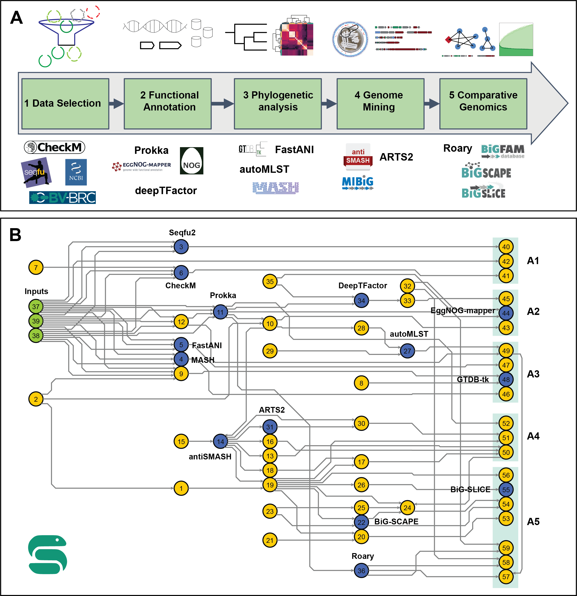

# BGCFlow
[](https://snakemake.bitbucket.io)
[](https://pep.databio.org)
[](https://github.com/NBChub/bgcflow/wiki)

`BGCFlow` is a systematic workflow for the analysis of biosynthetic gene clusters across large collections of genomes (pangenomes) from internal &amp; public datasets.

At present, `BGCFlow` is only tested and confirmed to work on **Linux** systems with `conda` / `mamba` package manager.

## Publication
> Matin Nuhamunada, Omkar S. Mohite, Patrick V. Phaneuf, Bernhard O. Palsson, and Tilmann Weber. (2023). BGCFlow: Systematic pangenome workflow for the analysis of biosynthetic gene clusters across large genomic datasets. bioRxiv 2023.06.14.545018; doi: [https://doi.org/10.1101/2023.06.14.545018](https://doi.org/10.1101/2023.06.14.545018)

## Pre-requisites
`BGCFlow` requires `gcc` and the `conda`/`mamba` package manager. See [installation instruction](https://github.com/NBChub/bgcflow/wiki/00-Installation-Guide) for details. 

Please use the latest version of `BGCFlow` available.
## Quick Start
A quick and easy way to use `BGCFlow` using [`bgcflow_wrapper`](https://github.com/NBChub/bgcflow_wrapper).

1. Create a conda environment and install the [`BGCFlow` python wrapper](https://github.com/NBChub/bgcflow_wrapper) :

```bash
# create and activate a new conda environment
conda create -n bgcflow pip -y
conda activate bgcflow

# install `BGCFlow` wrapper
pip install git+https://github.com/NBChub/bgcflow_wrapper.git

# make sure to use bgcflow_wrapper version >= 0.2.7
bgcflow --version
```

2. **Additional pre-requisites**:
With the environment activated, install or setup this configurations:
  - Set `conda` channel priorities to `flexible`
```bash
conda config --set channel_priority disabled
conda config --describe channel_priority
```
  - Java (required to run `metabase`)
```bash
conda install openjdk 
```

3. Deploy and run BGCFlow, change `your_bgcflow_directory` variable accordingly:
```bash
# Deploy and run BGCFlow
bgcflow clone <your_bgcflow_directory> # clone `BGCFlow` to your_bgcflow_directory
cd <your_bgcflow_directory> # move to BGCFLOW_PATH
bgcflow init # initiate `BGCFlow` config and examples from template
bgcflow run -n # do a dry run, remove the flag "-n" to run the example dataset
```

4. Build and serve interactive report (after `bgcflow run` finished). The report will be served in [http://localhost:8001/](http://localhost:8001/):
```bash
# build a report
bgcflow build report

# show available projects
bgcflow serve

# serve interactive report
bgcflow serve --project Lactobacillus_delbrueckii
```


- For detailed usage and configurations, have a look at the [`BGCFlow` WIKI](https://github.com/NBChub/bgcflow/wiki/) (`under development`) :warning:  
- Read more about [`bgcflow_wrapper`](https://github.com/NBChub/bgcflow_wrapper) for a detailed overview of the command line interface.

[](https://asciinema.org/a/595149)

## Workflow overview
The main Snakefile workflow comprises various pipelines for data selection, functional annotation, phylogenetic analysis, genome mining, and comparative genomics for Prokaryotic datasets.



Available pipelines in the main Snakefile can be checked using the following command:
```bash
bgcflow pipelines
```


## List of Available Pipelines
Here you can find pipeline keywords that you can run using the main Snakefile of BGCflow.

|    | Keyword           | Description                                                                                      | Links                                                                                    |
|---:|:------------------|:-------------------------------------------------------------------------------------------------|:-----------------------------------------------------------------------------------------|
|  0 | eggnog            | Annotate samples with eggNOG database (http://eggnog5.embl.de)                                   | [eggnog-mapper](https://github.com/eggnogdb/eggnog-mapper)                               |
|  1 | mash              | Calculate distance estimation for all samples using MinHash.                                     | [Mash](https://github.com/marbl/Mash)                                                    |
|  2 | fastani           | Do pairwise Average Nucleotide Identity (ANI) calculation across all samples.                    | [FastANI](https://github.com/ParBLiSS/FastANI)                                           |
|  3 | automlst-wrapper  | Simplified Tree building using [autoMLST](https://github.com/NBChub/automlst-simplified-wrapper) | [automlst-simplified-wrapper](https://github.com/KatSteinke/automlst-simplified-wrapper) |
|  4 | roary             | Build pangenome using Roary.                                                                     | [Roary](https://github.com/sanger-pathogens/Roary)                                       |
|  5 | eggnog-roary      | Annotate Roary output using eggNOG mapper                                                        | [eggnog-mapper](https://github.com/eggnogdb/eggnog-mapper)                               |
|  6 | seqfu             | Calculate sequence statistics using SeqFu.                                                       | [seqfu2](https://github.com/telatin/seqfu2)                                              |
|  7 | bigslice          | Cluster BGCs using BiG-SLiCE (https://github.com/medema-group/bigslice)                          | [bigslice](https://github.com/medema-group/bigslice)                                     |
|  8 | query-bigslice    | Map BGCs to BiG-FAM database (https://bigfam.bioinformatics.nl/)                                 | [bigfam.bioinformatics.nl](https://bigfam.bioinformatics.nl)                             |
|  9 | checkm            | Assess genome quality with CheckM.                                                               | [CheckM](https://github.com/Ecogenomics/CheckM)                                          |
| 10 | gtdbtk            | Taxonomic placement with GTDB-Tk                                                                 | [GTDBTk](https://github.com/Ecogenomics/GTDBTk)                                          |
| 11 | prokka-gbk        | Copy annotated genbank results.                                                                  | [prokka](https://github.com/tseemann/prokka)                                             |
| 12 | antismash         | Summarizes antiSMASH result.                                                                     | [antismash](https://github.com/antismash/antismash)                                      |
| 13 | arts              | Run Antibiotic Resistant Target Seeker (ARTS) on samples.                                        | [arts](https://bitbucket.org/ziemertlab/arts)                                            |
| 14 | deeptfactor       | Use deep learning to find Transcription Factors.                                                 | [deeptfactor](https://bitbucket.org/kaistsystemsbiology/deeptfactor)                     |
| 15 | deeptfactor-roary | Use DeepTFactor on Roary outputs.                                                                | [Roary](https://github.com/sanger-pathogens/Roary)                                       |
| 16 | cblaster-genome   | Build diamond database of genomes for cblaster search.                                           | [cblaster](https://github.com/gamcil/cblaster)                                           |
| 17 | cblaster-bgc      | Build diamond database of BGCs for cblaster search.                                              | [cblaster](https://github.com/gamcil/cblaster)                                           |
| 18 | bigscape          | Cluster BGCs using BiG-SCAPE                                                                     | [BiG-SCAPE](https://github.com/medema-group/BiG-SCAPE)                                   |


## References
> - *eggNOG-mapper v2: functional annotation, orthology assignments, and domain prediction at the metagenomic scale. Carlos P. Cantalapiedra, Ana Hernandez-Plaza, Ivica Letunic, Peer Bork, Jaime Huerta-Cepas. 2021. [Molecular Biology and Evolution, msab293](https://doi.org/10.1093/molbev/msab293)*
> - *eggNOG 5.0: a hierarchical, functionally and phylogenetically annotated orthology resource based on 5090 organisms and 2502 viruses. Jaime Huerta-Cepas, Damian Szklarczyk, Davide Heller, Ana Hernández-Plaza, Sofia K Forslund, Helen Cook, Daniel R Mende, Ivica Letunic, Thomas Rattei, Lars J Jensen, Christian von Mering, Peer Bork [Nucleic Acids Res. 2019 Jan 8; 47(Database issue): D309–D314. doi: 10.1093/nar/gky1085](https://academic.oup.com/nar/article/47/D1/D309/5173662)*
> - *Mash: fast genome and metagenome distance estimation using MinHash. Ondov BD, Treangen TJ, Melsted P, Mallonee AB, Bergman NH, Koren S, Phillippy AM. [Genome Biol. 2016 Jun 20;17(1):132. doi: 10.1186/s13059-016-0997-x.](https://genomebiology.biomedcentral.com/articles/10.1186/s13059-016-0997-x)*
> - *Mash Screen: high-throughput sequence containment estimation for genome discovery. Ondov BD, Starrett GJ, Sappington A, Kostic A, Koren S, Buck CB, Phillippy AM. [Genome Biol. 2019 Nov 5;20(1):232. doi: 10.1186/s13059-019-1841-x.](https://genomebiology.biomedcentral.com/articles/10.1186/s13059-019-1841-x)*
> - *Jain, C., Rodriguez-R, L.M., Phillippy, A.M. et al. High throughput ANI analysis of 90K prokaryotic genomes reveals clear species boundaries. Nat Commun 9, 5114 (2018). [https://doi.org/10.1038/s41467-018-07641-9](https://doi.org/10.1038/s41467-018-07641-9)*
> - *Mohammad Alanjary, Katharina Steinke, Nadine Ziemert, AutoMLST: an automated web server for generating multi-locus species trees highlighting natural product potential,[Nucleic Acids Research, Volume 47, Issue W1, 02 July 2019, Pages W276–W282](https://doi.org/10.1093/nar/gkz282)*
> - *Andrew J. Page, Carla A. Cummins, Martin Hunt, Vanessa K. Wong, Sandra Reuter, Matthew T. G. Holden, Maria Fookes, Daniel Falush, Jacqueline A. Keane, Julian Parkhill, 'Roary: Rapid large-scale prokaryote pan genome analysis', Bioinformatics, 2015;31(22):3691-3693 [doi:10.1093/bioinformatics/btv421](https://academic.oup.com/bioinformatics/article/31/22/3691/240757)*
> - *Andrew J. Page, Carla A. Cummins, Martin Hunt, Vanessa K. Wong, Sandra Reuter, Matthew T. G. Holden, Maria Fookes, Daniel Falush, Jacqueline A. Keane, Julian Parkhill, 'Roary: Rapid large-scale prokaryote pan genome analysis', Bioinformatics, 2015;31(22):3691-3693 [doi:10.1093/bioinformatics/btv421](https://academic.oup.com/bioinformatics/article/31/22/3691/240757)*
> - *eggNOG-mapper v2: functional annotation, orthology assignments, and domain prediction at the metagenomic scale. Carlos P. Cantalapiedra, Ana Hernandez-Plaza, Ivica Letunic, Peer Bork, Jaime Huerta-Cepas. 2021. [Molecular Biology and Evolution, msab293](https://doi.org/10.1093/molbev/msab293)*
> - *eggNOG 5.0: a hierarchical, functionally and phylogenetically annotated orthology resource based on 5090 organisms and 2502 viruses. Jaime Huerta-Cepas, Damian Szklarczyk, Davide Heller, Ana Hernández-Plaza, Sofia K Forslund, Helen Cook, Daniel R Mende, Ivica Letunic, Thomas Rattei, Lars J Jensen, Christian von Mering, Peer Bork Nucleic Acids Res. 2019 Jan 8; 47(Database issue): D309–D314. [doi: 10.1093/nar/gky1085](https://academic.oup.com/nar/article/47/D1/D309/5173662)*
> - *Telatin, A., Birolo, G., & Fariselli, P. SeqFu [Computer software]. GITHUB: [https://github.com/telatin/seqfu2](https://github.com/telatin/seqfu2)*
> - *Satria A Kautsar, Justin J J van der Hooft, Dick de Ridder, Marnix H Medema, BiG-SLiCE: A highly scalable tool maps the diversity of 1.2 million biosynthetic gene clusters, [GigaScience, Volume 10, Issue 1, January 2021, giaa154](https://doi.org/10.1093/gigascience/giaa154)*
> - *Satria A Kautsar, Kai Blin, Simon Shaw, Tilmann Weber, Marnix H Medema, BiG-FAM: the biosynthetic gene cluster families database, Nucleic Acids Research, gkaa812, [https://doi.org/10.1093/nar/gkaa812](https://doi.org/10.1093/nar/gkaa812)*
> - *Satria A Kautsar, Justin J J van der Hooft, Dick de Ridder, Marnix H Medema, BiG-SLiCE: A highly scalable tool maps the diversity of 1.2 million biosynthetic gene clusters, [GigaScience, Volume 10, Issue 1, January 2021, giaa154.](https://doi.org/10.1093/gigascience/giaa154)*
> - *Parks DH, Imelfort M, Skennerton CT, Hugenholtz P, Tyson GW. 2014. Assessing the quality of microbial genomes recovered from isolates, single cells, and metagenomes. [Genome Research, 25: 1043-1055.](https://genome.cshlp.org/content/25/7/1043.long)*
> - *Chaumeil PA, et al. 2019. GTDB-Tk: A toolkit to classify genomes with the Genome Taxonomy Database. Bioinformatics, btz848.*
> - *Parks DH, et al. 2020. A complete domain-to-species taxonomy for Bacteria and Archaea. Nature Biotechnology, [https://doi.org/10.1038/s41587-020-0501-8]([https://doi.org/10.1038/s41587-020-0501-8).*
> - *Parks DH, et al. 2018. A standardized bacterial taxonomy based on genome phylogeny substantially revises the tree of life. Nature Biotechnology, [http://dx.doi.org/10.1038/nbt.4229](http://dx.doi.org/10.1038/nbt.4229).*
> - *Seemann T. Prokka: rapid prokaryotic genome annotation. [Bioinformatics 2014 Jul 15;30(14):2068-9. PMID:24642063](https://academic.oup.com/bioinformatics/article/30/14/2068/2390517?login=false)*
> - *antiSMASH 6.0: improving cluster detection and comparison capabilities. Kai Blin, Simon Shaw, Alexander M Kloosterman, Zach Charlop-Powers, Gilles P van Weezel, Marnix H Medema, & Tilmann Weber. Nucleic Acids Research (2021) [doi: 10.1093/nar/gkab335.](https://academic.oup.com/nar/article/49/W1/W29/6274535?login=false)*
> - *Mungan,M.D., Alanjary,M., Blin,K., Weber,T., Medema,M.H. and Ziemert,N. (2020) ARTS 2.0: feature updates and expansion of the Antibiotic Resistant Target Seeker for comparative genome mining. [Nucleic Acids Res.,10.1093/nar/gkaa374](https://academic.oup.com/nar/article/48/W1/W546/5840579)*
> - *Alanjary,M., Kronmiller,B., Adamek,M., Blin,K., Weber,T., Huson,D., Philmus,B. and Ziemert,N. (2017) The Antibiotic Resistant Target Seeker (ARTS), an exploration engine for antibiotic cluster prioritization and novel drug target discovery. [Nucleic Acids Res.,10.1093/nar/gkx360](https://academic.oup.com/nar/article/45/W1/W42/3787867?login=false)*
> - *Kim G.B., Gao Y., Palsson B.O., Lee S.Y. 2020. DeepTFactor: A deep learning-based tool for the prediction of transcription factors. [PNAS. doi: 10.1073/pnas.2021171118](https://www.pnas.org/doi/10.1073/pnas.2021171118)*
> - *Kim G.B., Gao Y., Palsson B.O., Lee S.Y. 2020. DeepTFactor: A deep learning-based tool for the prediction of transcription factors. [PNAS. doi: 10.1073/pnas.2021171118](https://www.pnas.org/doi/10.1073/pnas.2021171118)*
> - *Andrew J. Page, Carla A. Cummins, Martin Hunt, Vanessa K. Wong, Sandra Reuter, Matthew T. G. Holden, Maria Fookes, Daniel Falush, Jacqueline A. Keane, Julian Parkhill, 'Roary: Rapid large-scale prokaryote pan genome analysis', [Bioinformatics, 2015;31(22):3691-3693 doi:10.1093/bioinformatics/btv421](https://academic.oup.com/bioinformatics/article/31/22/3691/240757)*
> - *Gilchrist, C., Booth, T. J., van Wersch, B., van Grieken, L., Medema, M. H., & Chooi, Y. (2021). cblaster: a remote search tool for rapid identification and visualisation of homologous gene clusters (Version 1.3.9) [Computer software]. [https://doi.org/10.1101/2020.11.08.370601](https://doi.org/10.1101/2020.11.08.370601)*
> - *Buchfink, B., Xie, C. & Huson, D. H. Fast and sensitive protein alignment using DIAMOND. [Nat. Methods 12, 59–60 (2015)](https://www.nature.com/articles/nmeth.3176).*
> - *Gilchrist, C., Booth, T. J., van Wersch, B., van Grieken, L., Medema, M. H., & Chooi, Y. (2021). cblaster: a remote search tool for rapid identification and visualisation of homologous gene clusters (Version 1.3.9) [Computer software]. [https://doi.org/10.1101/2020.11.08.370601](https://doi.org/10.1101/2020.11.08.370601)*
> - *Buchfink, B., Xie, C. & Huson, D. H. Fast and sensitive protein alignment using DIAMOND. [Nat. Methods 12, 59–60 (2015)](https://www.nature.com/articles/nmeth.3176).*
> - *Navarro-Muñoz, J.C., Selem-Mojica, N., Mullowney, M.W. et al. A computational framework to explore large-scale biosynthetic diversity. [Nat Chem Biol 16, 60–68 (2020)](https://doi.org/10.1038/s41589-019-0400-9)*
​