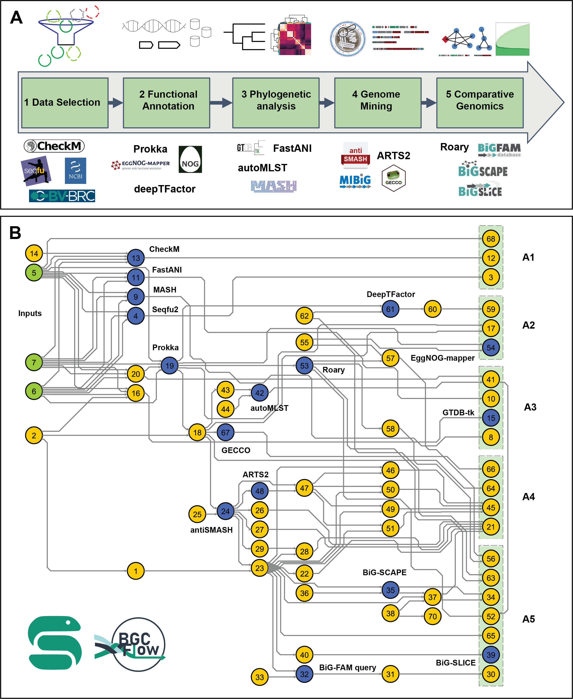

# BGCFlow
[](https://snakemake.bitbucket.io)
[](https://pep.databio.org)
[](https://github.com/NBChub/bgcflow/wiki)

`BGCFlow` is a systematic workflow for the analysis of biosynthetic gene clusters across large collections of genomes (pangenomes) from internal &amp; public datasets.

At present, `BGCFlow` is only tested and confirmed to work on **Linux** systems with `conda` / `mamba` package manager.

## Publication
> Matin Nuhamunada, Omkar S. Mohite, Patrick V. Phaneuf, Bernhard O. Palsson, and Tilmann Weber. (2023). BGCFlow: Systematic pangenome workflow for the analysis of biosynthetic gene clusters across large genomic datasets. bioRxiv 2023.06.14.545018; doi: [https://doi.org/10.1101/2023.06.14.545018](https://doi.org/10.1101/2023.06.14.545018)

## Pre-requisites
BGCFlow requires `gcc` and the `conda`/`mamba` package manager. See [installation instruction](https://github.com/NBChub/bgcflow/wiki/00-Installation-Guide) for details. 

Please use the latest version of BGCFlow available.
## Quick Start
A quick and easy way to use BGCFlow using [`bgcflow_wrapper`](https://github.com/NBChub/bgcflow_wrapper).

1. Create a conda environment and install the [BGCFlow python wrapper](https://github.com/NBChub/bgcflow_wrapper) :

```bash
# create and activate a new conda environment
conda create -n bgcflow pip -y
conda activate bgcflow

# install BGCFlow wrapper
pip install git+https://github.com/NBChub/bgcflow_wrapper.git

# make sure to use bgcflow_wrapper version >= 0.2.7
bgcflow --version
```

2. **Additional pre-requisites**:
With the environment activated, install or setup this configurations:
  - Set `conda` channel priorities to `flexible`
```bash
conda config --set channel_priority disabled
conda config --describe channel_priority
```
  - Java (required to run `metabase`)
```bash
conda install openjdk 
```

3. Deploy and run BGCFlow, change `your_bgcflow_directory` variable accordingly:
```bash
# Deploy and run BGCFlow
bgcflow clone <your_bgcflow_directory> # clone BGCFlow to your_bgcflow_directory
cd <your_bgcflow_directory> # move to BGCFLOW_PATH
bgcflow init # initiate BGCFlow config and examples from template
bgcflow run -n # do a dry run, remove the flag "-n" to run the example dataset
```

4. Build and serve interactive report (after `bgcflow run` finished). The report will be served in [http://localhost:8001/](http://localhost:8001/):
```bash
# build a report
bgcflow build report

# show available projects
bgcflow serve

# serve interactive report
bgcflow serve --project Lactobacillus_delbrueckii
```


- For detailed usage and configurations, have a look at the [BGCFlow WIKI](https://github.com/NBChub/bgcflow/wiki/) (`under development`) :warning:  
- Read more about [`bgcflow_wrapper`](https://github.com/NBChub/bgcflow_wrapper) for a detailed overview of the command line interface.

[](https://asciinema.org/a/595149)

## Workflow overview
The main Snakefile workflow comprises various pipelines for data selection, functional annotation, phylogenetic analysis, genome mining, and comparative genomics for Prokaryotic datasets.



Available pipelines in the main Snakefile can be checked using the following command:
```
bgcflow pipelines
```


## List of Available Pipelines
Here you can find pipeline keywords that you can run using the main Snakefile of BGCflow.

|    | Keyword           | Description                                                                                      | Links                                                                                    |
|---:|:------------------|:-------------------------------------------------------------------------------------------------|:-----------------------------------------------------------------------------------------|
|  0 | eggnog            | Annotate samples with eggNOG database (http://eggnog5.embl.de)                                   | [eggnog-mapper](https://github.com/eggnogdb/eggnog-mapper)                               |
|  1 | mash              | Calculate distance estimation for all samples using MinHash.                                     | [Mash](https://github.com/marbl/Mash)                                                    |
|  2 | fastani           | Do pairwise Average Nucleotide Identity (ANI) calculation across all samples.                    | [FastANI](https://github.com/ParBLiSS/FastANI)                                           |
|  3 | automlst-wrapper  | Simplified Tree building using [autoMLST](https://github.com/NBChub/automlst-simplified-wrapper) | [automlst-simplified-wrapper](https://github.com/KatSteinke/automlst-simplified-wrapper) |
|  4 | roary             | Build pangenome using Roary.                                                                     | [Roary](https://github.com/sanger-pathogens/Roary)                                       |
|  5 | eggnog-roary      | Annotate Roary output using eggNOG mapper                                                        | [eggnog-mapper](https://github.com/eggnogdb/eggnog-mapper)                               |
|  6 | seqfu             | Calculate sequence statistics using SeqFu.                                                       | [seqfu2](https://github.com/telatin/seqfu2)                                              |
|  7 | bigslice          | Cluster BGCs using BiG-SLiCE (https://github.com/medema-group/bigslice)                          | [bigslice](https://github.com/medema-group/bigslice)                                     |
|  8 | query-bigslice    | Map BGCs to BiG-FAM database (https://bigfam.bioinformatics.nl/)                                 | [bigfam.bioinformatics.nl](https://bigfam.bioinformatics.nl)                             |
|  9 | checkm            | Assess genome quality with CheckM.                                                               | [CheckM](https://github.com/Ecogenomics/CheckM)                                          |
| 10 | gtdbtk            | Taxonomic placement with GTDB-Tk                                                                 | [GTDBTk](https://github.com/Ecogenomics/GTDBTk)                                          |
| 11 | prokka-gbk        | Copy annotated genbank results.                                                                  | [prokka](https://github.com/tseemann/prokka)                                             |
| 12 | antismash         | Summarizes antiSMASH result.                                                                     | [antismash](https://github.com/antismash/antismash)                                      |
| 13 | arts              | Run Antibiotic Resistant Target Seeker (ARTS) on samples.                                        | [arts](https://bitbucket.org/ziemertlab/arts)                                            |
| 14 | deeptfactor       | Use deep learning to find Transcription Factors.                                                 | [deeptfactor](https://bitbucket.org/kaistsystemsbiology/deeptfactor)                     |
| 15 | deeptfactor-roary | Use DeepTFactor on Roary outputs.                                                                | [Roary](https://github.com/sanger-pathogens/Roary)                                       |
| 16 | cblaster-genome   | Build diamond database of genomes for cblaster search.                                           | [cblaster](https://github.com/gamcil/cblaster)                                           |
| 17 | cblaster-bgc      | Build diamond database of BGCs for cblaster search.                                              | [cblaster](https://github.com/gamcil/cblaster)                                           |
| 18 | bigscape          | Cluster BGCs using BiG-SCAPE                                                                     | [BiG-SCAPE](https://github.com/medema-group/BiG-SCAPE)                                   |


