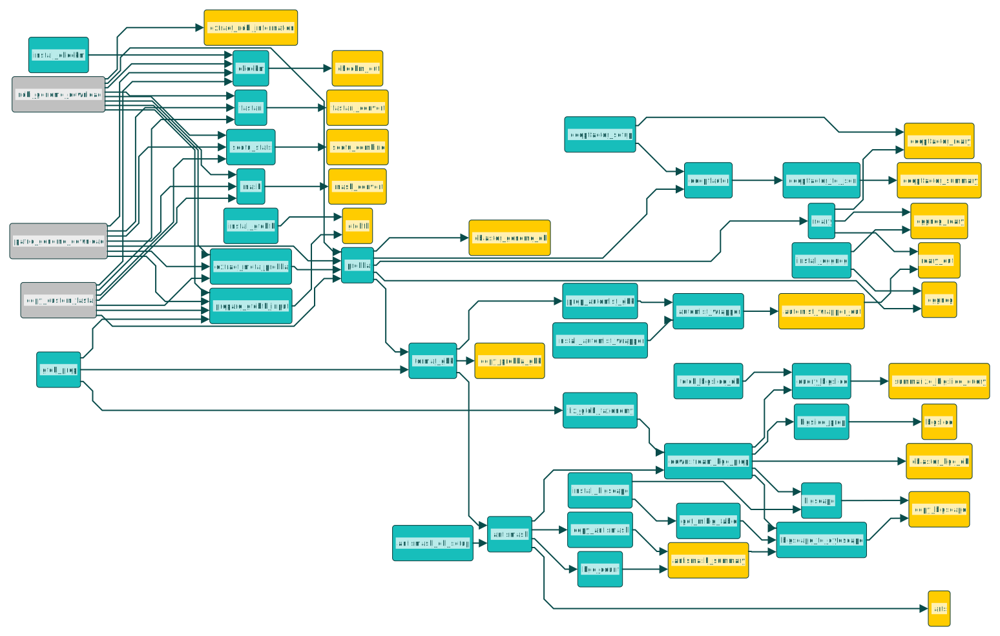

# BGCflow
[](https://snakemake.bitbucket.io)
[](https://travis-ci.org/snakemake-workflows/snakemake-bgc-analytics)

Snakemake workflow to systematically analyze Biosynthetic Gene Clusters from a collection of genomes (pangenomes) from internal &amp; public genome datasets.

## Workflow overview

## Usage
### Step 1: Clone the workflow

[Clone](https://help.github.com/en/articles/cloning-a-repository) this repository to your local system, into the place where you want to perform the data analysis. _Make sure to have the right access / SSH Key._

    git clone git@github.com:NBChub/bgcflow.git
    cd bgcflow

### Step 2: Configure the workflow
#### 2.1 Setting Up Your Project Information
Configure the workflow according to your needs via editing the files in the `config/` folder. Adjust `config.yaml` to configure your `project` and the workflow execution.

In the `config.yaml`, each `project` starts with "`-`" and must contain the name of your project (`name`) and the location of the sample file (`samples.csv`):

```yaml
projects:
  - name: example
    samples: config/samples.csv
```

Ideally, a project is a set of genomes of certain clade (pangenome) and can be annotated using a set of well-known reference genomes.

See [further configuration](#further-configuration) for more details.

#### 2.2 Setting Up Your Samples Information
The parameter `samples` denote the location of your `.csv` file which specify the genomes to analyse. Note that you can name the file anything as long as you define it in the `config.yaml`.

Example : `samples.csv`

| genome_id       | source | organism                        | genus        | species | strain     |closest_placement_reference|
|----------------:|-------:|--------------------------------:|-------------:|--------:| ----------:|--------------------------:|
| GCF_000359525.1 | ncbi   |                                 |              |         | J1074      |                           |
| 1223307.4       | patric | Streptomyces sp. PVA 94-07      | Streptomyces | sp.     | PVA 94-07  | GCF_000495755.1           |
| P8-2B-3.1       | custom | Streptomyces sp. P8-2B-3        | Streptomyces | sp.     | P8-2B-3    |                           |

Columns description:
- **`genome_id`** _[required]_:  The genome accession ids (with genome version for `ncbi` and `patric` genomes). For `custom` fasta file provided by users, it should refer to the fasta file names stored in `data/raw/fasta/` directory with `.fna` extension. **Example:** genome id P8-2B-3.1 refers to the file `data/raw/fasta/P8-2B-3.1.fna`.
- **`source`** _[required]_: Source of the genome to be analyzed choose one of the following: `custom`, `ncbi`, `patric`. Where:
  - `custom` : for user provided genomes (`.fna`) in the `data/raw/fasta` directory with genome ids as filenames 
  - `ncbi` : for list of public genome accession IDs that will be downloaded from the NCBI refseq (GCF...) or genbank (GCA...) database
  - `patric`: for list of public genome accession IDs that will be downloaded from the PATRIC database 
- `organism` _[optional]_ : name of the organism that is same as in the fasta header
- `genus` _[optional]_ : genus of the organism. Ideally identified with GTDBtk.
- `species` _[optional]_ : species epithet (the second word in a species name) of the organism. Ideally identified with GTDBtk.
- `strain` _[optional]_ : strain id of the organism
- `closest_placement_reference` _[optional]_: if known, the closest NCBI genome to the organism. Ideally identified with GTDBtk.

Further formatting rules are defined in the `workflow/schemas/` folder.

### Step 3: Install Snakemake

Installing Snakemake using [Mamba](https://github.com/mamba-org/mamba) is advised. In case you don’t use [Mambaforge](https://github.com/conda-forge/miniforge#mambaforge) you can always install [Mamba](https://github.com/mamba-org/mamba) into any other Conda-based Python distribution with:

    conda install -n base -c conda-forge mamba

Then install Snakemake (version 6.15.1) with:

    mamba create -c conda-forge -c bioconda -n snakemake snakemake=6.15.1

If you already have Snakemake, then update it to version 6.15.1 that is supported by BGCflow with:

    mamba update -c conda-forge -c bioconda -n snakemake snakemake=6.15.1

For installation details, see the [instructions in the Snakemake documentation](https://snakemake.readthedocs.io/en/stable/getting_started/installation.html).

### Step 4: Execute workflow

Activate the conda environment:

    conda activate snakemake

Test your configuration by performing a dry-run via:

    snakemake --use-conda -n

Execute the workflow locally via:

    snakemake --use-conda --cores {number} --keep-going

Check you job DAG by executing:

    snakemake --dag | dot -Tsvg > workflow/report/images/dag.svg

See the [Snakemake documentation](https://snakemake.readthedocs.io/en/stable/executable.html) for further details.

### Step 5: Investigate results

After successful execution, you can zip a self-contained interactive HTML report with all results via:

    snakemake --report report.zip

This report can, e.g., be forwarded to your collaborators.

## Further configuration
### Custom Prokka database
You can add an optional parameters: `prokka-db`, which refer to the location of a `.csv` file containing a list of your custom reference genomes for [`prokka`](https://github.com/tseemann/prokka#option---proteins) annotation:
```yaml
projects:
  - name: example
    samples: config/samples.csv
    prokka-db: config/prokka-db.csv
```

The file `prokka-db.csv` should contain a list of high quality annotated genomes that you would like to use to prioritise prokka annotations. 

`prokka-db.csv` example for Actinomycete group:

| Accession       | Strain Description             |
|----------------:|-------------------------------:|
| GCA_000203835.1 | Streptomyces coelicolor A3(2)  |
| GCA_000196835.1 | Amycolatopsis mediterranei U32 |

### Taxonomic Placement
The workflow will prioritize user provided taxonomic placement by adding an optional parameters: `gtdb-tax`, which refer to a similar GTDB-tk summary file, but only the "user_genome" and "classification" columns are required.

`gtdbtk.bac120.summary.tsv` example:

| user_genome | classification	                                                                                                                       |
|------------:|---------------------------------------------------------------------------------------------------------------------------------------:|
| P8-2B-3.1   | d__Bacteria;p__Actinobacteriota;c__Actinomycetia;o__Streptomycetales;f__Streptomycetaceae;g__Streptomyces;s__Streptomyces albidoflavus |

If these are not provided, the workflow will use the `closest_placement_reference` columns in the sample file (see above). Note that the value must be a valid genome accession in the latest GTDB release (currently R202), otherwise it will raise an error. 

If these information is not provided, then the workflow will guess the taxonomic placement by:
1. If the `source` is `ncbi`, it will try to find the accession via GTDB API. If it doesn't find any information then,
2. It will use the `genus` table and find the parent taxonomy via GTDB API, which then results in `_genus_ sp.` preceded by the matching parent taxonomy.
3. If both option does not find any taxonomic information, then it will return empty taxonomic values.

### Running multiple projects
You can have multiple projects running by starting a new line of project information with "`-`":

```yaml
projects:
# Project 1
  - name: example
    samples: config/samples.csv
    prokka-db: config/prokka-db.csv
# Project 2
  - name: example_2
    samples: config/samples_2.csv
```
Note that each `project` must have unique `name` and `samples` value.
### Choosing which analysis to run
You can choose which analysis to run by setting the parameter value to `TRUE` or `FALSE`:
```yaml
rules:
  bigscape: TRUE
  mlst: TRUE
  refseq_masher: TRUE
  seqfu: TRUE
  eggnog: FALSE
  ```
### Setting custom resources/databases folder
By default, the resources folder containing software and database dependencies are stored in the `resources/` directory. 

If you already have the resources folder somewhere else in your local machine, you can tell the workflow about their locations:

```yaml
resources_path: 
  antismash_db: $HOME/your_local_directory/antismash_db
  eggnog_db: $HOME/your_local_directory/eggnog_db
  BiG-SCAPE: $HOME/your_local_directory/BiG-SCAPE
```
